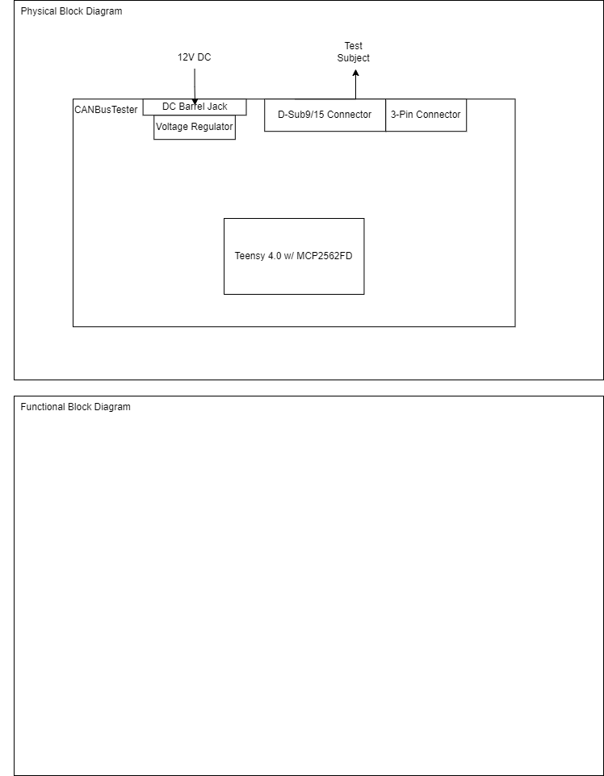

# CANBusTester
The goal of this device is to test the perfomance of CAN logging devices by measuring the amount of dropped packets.

## Requirements
- Measure performance of CAN Bus logging devices 
  - How many packets dropped
  - Minimum bus load before packets start dropping
  - How long can it handle full bus load before packet loss
- Operates at 100% bus load indefinitely
- Test subject outputs a log file
  - Log file needs time, extended ID, and data
- Device requires SocketCAN to work
- CAN bus tester is able to test any CAN bus logging device
- This device will support multiple I/O connection types 
  - D-sub 9
  - D-sub 15
  - Mini USB
  - MicroSD Slot
- Implements self tests to isolate the testing system and verify it works
- Sends and receives on one CAN line
## Test System Block Diagram

## Implementation
* **Raspberry pi**
  - User Interface
    * Allows for flooding the bus with start and stop commands to the CAN Logger 3
    * Configuring and running self tests
  - CAN Shield
    * Checks to see if voltage and resistance on the CAN bus are correct
* **Teensy 4.0 w/ MCP2562**
  - Flood CAN line
    * Sends messages at 100% bus load to obersve if any packets get dropped
    * Push buttons can be used to start and stop test in addition to GUI
* **Test Subject**
  - Logs can data
    * Outputs CAN data into a log file that determines wether the test was passed

## Test Plan
* **Test Case - **

