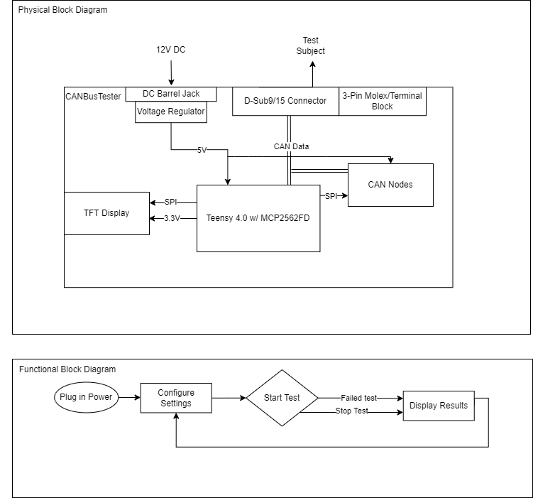

# CANBusTester
The goal of this device is to test the perfomance of CAN logging devices by measuring the amount of dropped packets.

## Requirements
- Measure performance of CAN Bus logging devices 
  - How many packets dropped
  - Minimum bus load before packets start dropping
  - How long can it handle full bus load before packet loss
- Operates at 100% bus load
- Can function without any external devies
- Surface of the device should not exceed 100 degrees fahrenheit
- Device has two independent properly terminated CAN buses
- Test subject outputs a log file
  - Log file needs time, extended ID, and data
- CAN bus tester is able to test any CAN bus logging device
- Supports CAN2.0 compliant with ISO11898-2/5 
- This device will support multiple I/O connection types 
  - D-sub 9
  - D-sub 15
  - 3-pin screw terminal 
  - Barrel Jack (Power input for teensy4.0) -> 12+v step down to 5v
- Implements self tests (<1s) to isolate the testing system and verify it works
- Supports at least two CAN channels up to 1MB/s
- Supports at least one CANFD channel up to 8MB/s
- For basic single CAN channel testing, CAN transcievers are bridged.
  - This allows testing slow devices without write buffers filling up.
- Simple to operate
  - Less than 10 seconds to perform the basic CAN bus test.
- Portable
  - Smaller than 6" x 6" x 3"
## Test System Block Diagram

## Implementation
* **Teensy 4.0 w/ MCP2562FD**
  - Flood CAN line(s)
    * Sends messages at 100% bus load to obersve if any packets get dropped
  - Configuring and running self tests
* **Test Subject**
  - Logs can data
    * Outputs CAN data into a log file that determines wether the test was passed

## Test Plan
* Test Case - 

